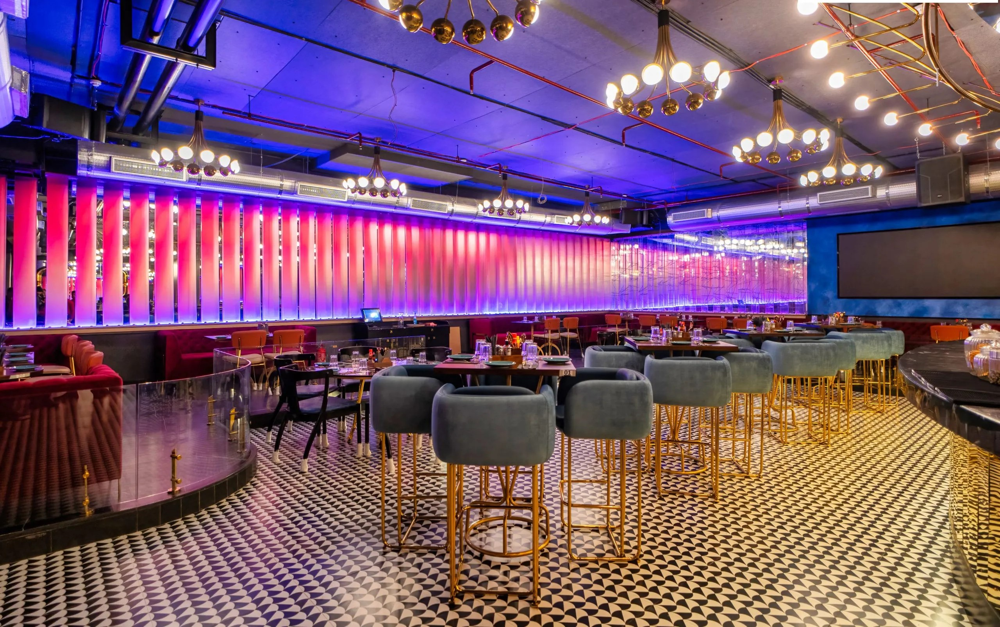
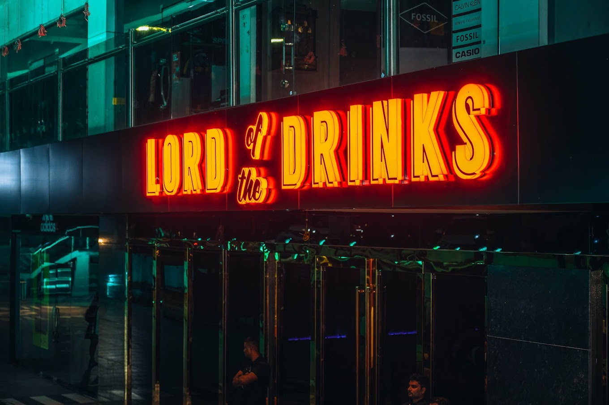
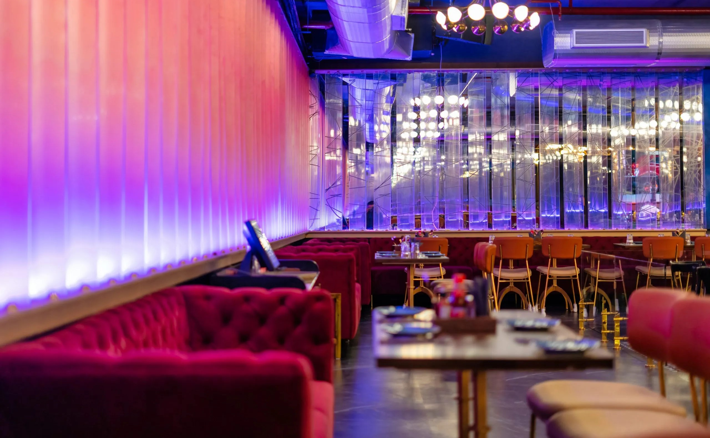
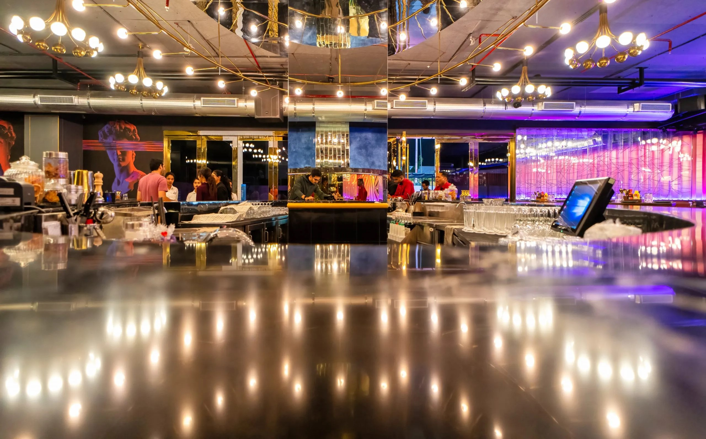
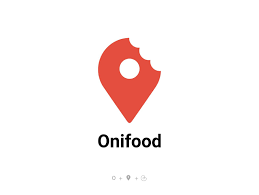

<html>

<head>
    <meta charset="UTF-8">
    <meta name="viewport" content="width=device-width, initial-scale=1.0">
    <title>Load of Drink</title>
    <link rel="stylesheet" href="load.css" type="text/css">
    <link href="https://cdn.jsdelivr.net/npm/bootstrap@5.0.2/dist/css/bootstrap.min.css" rel="stylesheet"
        integrity="sha384-EVSTQN3/azprG1Anm3QDgpJLIm9Nao0Yz1ztcQTwFspd3yD65VohhpuuCOmLASjC" crossorigin="anonymous">
    
    <link rel="preconnect" href="https://fonts.googleapis.com">
    <link rel="preconnect" href="https://fonts.gstatic.com" crossorigin>
    <link href="https://fonts.googleapis.com/css2?family=Oswald&display=swap" rel="stylesheet">
    <link rel="stylesheet" href="https://cdnjs.cloudflare.com/ajax/libs/font-awesome/6.4.0/css/all.min.css"
        integrity="sha512-iecdLmaskl7CVkqkXNQ/ZH/XLlvWZOJyj7Yy7tcenmpD1ypASozpmT/E0iPtmFIB46ZmdtAc9eNBvH0H/ZpiBw=="
        crossorigin="anonymous" referrerpolicy="no-referrer" />
</head>

<body>
    

        

        <nav>
            <ul>
                <li><a href="home.html">HOME</a></li>
                <li><a href="about.html">ABOUT</a></li>
                <li><a href="food-drinks.html">FOOD &amp; DRINKS</a></li>
                <li><a href="outlets.html">OUTLETS</a></li>
                <li><a href="contact.html">CONTACT</a></li>
                <li><a href="book-table.html">BOOK A TABLE</a></li>
            </ul>
        </nav>
    

    <!-- Bootstrap Carousel-->
    

        

            

                
            

            

                
            

            

                
            

            

                
            

        

        <button class="carousel-control-prev" type="button" data-bs-target="#carouselExampleInterval"
            data-bs-slide="prev">
            
            Previous
        </button>
        <button class="carousel-control-next" type="button" data-bs-target="#carouselExampleInterval"
            data-bs-slide="next">
            
            Next
        </button>
    

    
    

        <h4>Franchise with us!</h4> 
        
Want to be a part of Lord of the Drinks family? Become a link in our exciting chain of casual dining by
            franchising with Lord of the drinks!
              Discover the game of thrones ambience and stir up strong relationships,
            reinforced by customer loyalty for India's best dining and its long established  identity of offering
            steadfast quality and service.
        

    

    <section id="client-section">
        <h1 style="text-align: center;">OUR CLIENTS</h1>
        

            

                

            

            

                

            

            

                

            

            

                

            

        

    </section>

    <footer>
        

            

                

                    <h3>FRANCHISE ENQUIR</h3>
                    
Mobile : +91 - 9313663486  

                        <strong>Email:</strong>franchise@firstfiddle.in 
                      

                    

                

                

                    <h3>HR ENQUIRY
                    </h3>
                    
Email : hr@firstfiddle.in 
                    

                    

                        
<iframe width="200px" height="100px" frameborder="0" scrolling="no"
                                marginheight="0" marginwidth="0"
                                src="https://maps.google.com/maps?width=360px25&amp;height=&amp;hl=en&amp;q=S.%20B.%20Jain%20Institute%20of%20Technology,%20Management%20&amp;%20Research,%20Near%20Jain%20International%20School,%20Yerla%20Village,%20Kalmeshwar%20Road,%20Nagpur-441501+(SB%20jain)&amp;t=&amp;z=14&amp;ie=UTF8&amp;iwloc=B&amp;output=embed"><a
                                    href="https://www.maps.ie/distance-area-calculator.html">measure acres/hectares
                                    on map</a></iframe>

                    

                

                

                    <h3>BOOKING ENQUIRY</h3>
                    
Email : customercare@firstfiddle.in 
                        Mobile : 8433613616 
                    

                

            
  

            

                
PRIVACY POLICY | TERMS AND CONDITIONS | BLOG 

                    COPYRIGHT © 2021 LORD OF THE DRINKS

            
  
        

    </footer>
   

</body>

</html>
